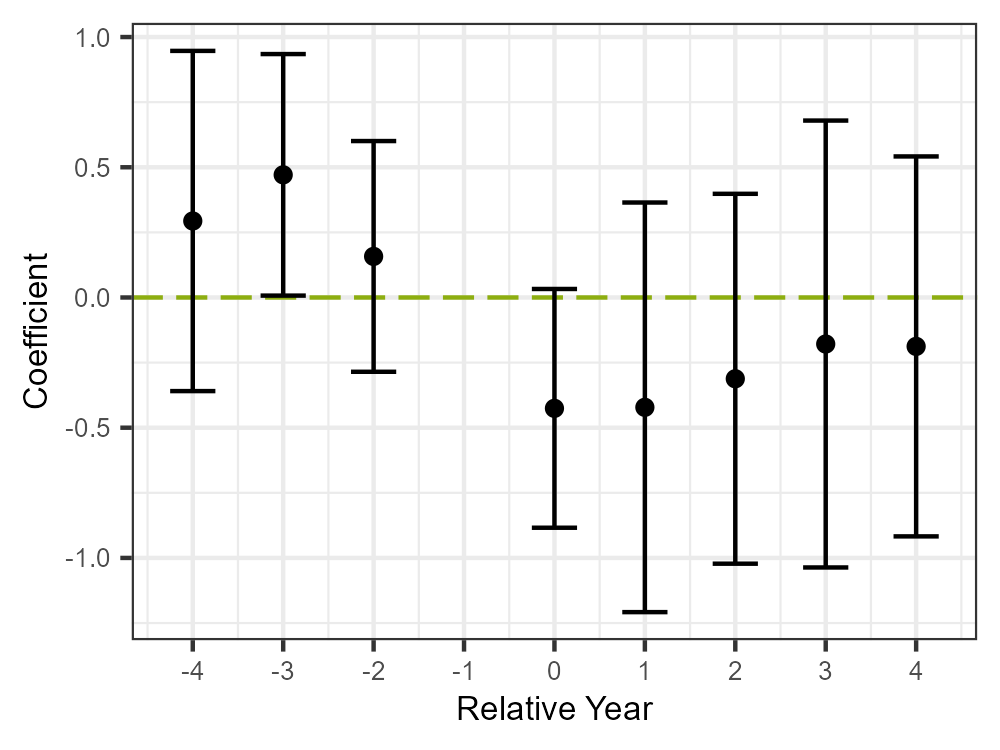

# Course Notes: Data Analysis Using R (WiSe 2025/26)

This repository serves as a note repository for the course “Data
Analysis Using R” held in winter semester 2025/26. In the `lecture`
folder, you will find the scripts created during the lectures. The rest
of the repository serves as an example repository for orientation in the
group projects.

The code in this repository replicates the findings of Feigenberg
(2020a) using data from Feigenberg (2020b) to briefly showcase how such
a data analysis project can be structured. Please note that the
structure outlined here serves as orientation only. There are several
equally good ways of structuring your data analysis project. You can
find the data used throughout the project in the `data` folder. The
corresponding R scripts are stored under `scripts`. Folders `figures`
and `tables` contain – not surprisingly – figures and tables created in
the analysis. A presentation on the results created via
[Quarto](https://quarto.org/) can be found under `presentation`.

## Key Findings

In “Fenced Out: The Impact of Border Construction on U.S.-Mexico
Migration”, Feigenberg (2020a) explores how the construction of the
U.S.-Mexico border fence following the Fence Secure Act from 2006
affected the migration decision of potential Mexican migrants. Using
spatio-temporal variations in fence construction as an exogenous shock,
Feigenberg (2020a) applies a difference-in-differences approach to
assess changes in migration likelihood. Data on fence construction was
obtained through U.S. Customs and Border Protection and other government
records. Data on the migration decision of Mexicans was obtained through
Mexican household surveys. This repository uses a 50% random draw from
Feigenberg (2020b) to replicate the results. My findings indicate a
significant reduction (37.4%) in migration likelihood due to the fence
construction, though pre-treatment trends suggest potential
overstatement of effects (see
<a href="#fig-event-logit" class="quarto-xref">Figure 1</a>). The
findings highlight the effectiveness of border enforcement policies but
emphasize methodological limitations and deviations from the original
study.

Feigenberg, Benjamin. 2020a. “Fenced Out: The Impact of Border
Construction on US-Mexico Migration.” *American Economic Journal:
Applied Economics* 12 (3): 106–39.
<https://doi.org/10.1257/app.20170231>.

———. 2020b. *Replication Package for: Fenced Out: The Impact of Border
Construction on US-Mexico Migration.* American Economic Association.
<https://www.aeaweb.org/journals/dataset?id=10.1257/app.20170231>.

